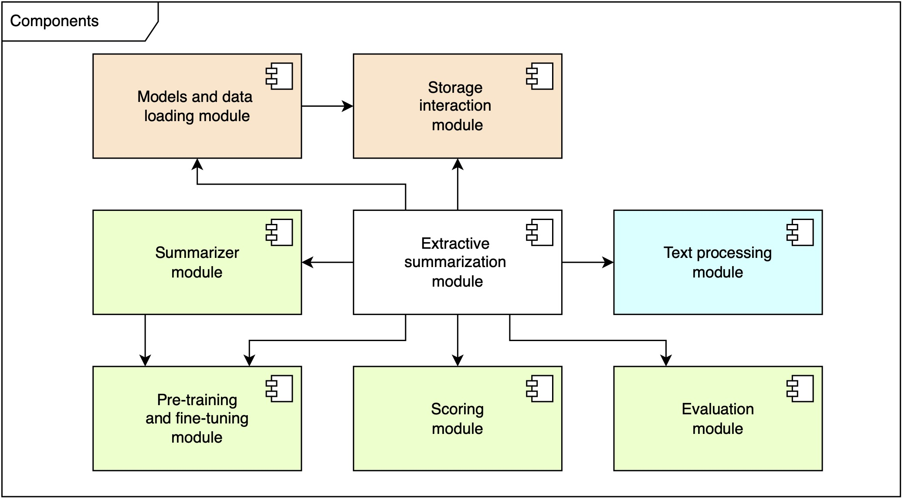
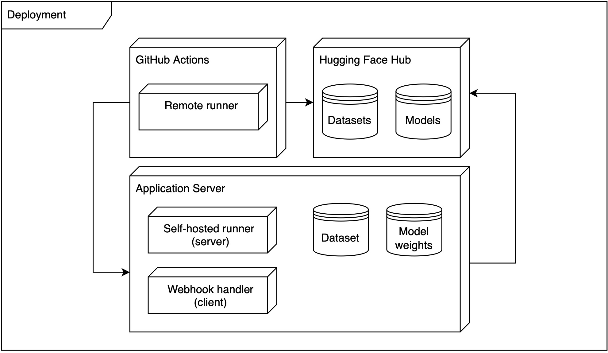

# NLPaper

**NLPaper** is an app that will help you to highlight the most
important information of any research paper.

## Aim 

To develop an extractive summarization system for research papers.

## Tasks

1. Research current approaches for extractive summarization;
2. develop the system architectures (diagrams);
3. collect and analyze the data from research papers (arXiv); 
4. develop preprocessing pipeline for the text; 
5. pre-train (or prepare) transformer models (DistilBERT and ALBERT) and
   tokenizers;
6. fine-tune the models using a masked language modeling (MLM) objective;
7. use the models as feature extractors with a summarizer and get top n
   sentences;
8. evaluate metrics on the dataset (perplexity) and select the 
best model based on the metric;
9. deploy the service on a application server;
10. optimize the selected model (or data) (i.e. compress it);

## Dataset

### Link:
[ml-arxiv-papers](https://huggingface.co/datasets/aalksii/ml-arxiv-papers)

### Description:
The dataset consists of 117592 research paper abstracts from arXiv. 
The train and test ratios 0.9 and 0.1, so it makes 105832 and 11760 rows.
The original dataset can be found on 
[Kaggle](https://www.kaggle.com/datasets/Cornell-University/arxiv) and 
ML papers only version on 
[CShorten/ML-ArXiv-Papers](https://huggingface.co/datasets/CShorten/ML-ArXiv-Papers). 
The average length of the abstracts is 1157 symbols.

### Expediency of its use: 

- The abstracts can be used to fine-tune BERT-based models using masked language
modeling technique. Since a BERT model was pre-trained using only an unlabeled,
plain text corpus (English Wikipedia, the Brown Corpus), it can be less
prepared for a scientific language such as that found in arXiv dataset.
However, the dataset can be edited with masking and fed into the models. Then
it is possible to use such a fine-tuned model for sentence embeddings.

- The topic of all papers in the dataset is machine learning, so it should
be easier for a model to adapt to a new domain.

## Project diagrams

### Component diagram

Figure 1. Pipeline components

### Activity diagram

Figure 2. Model usage pipeline

### Deployment diagram

Figure 3. Deployment pipeline

